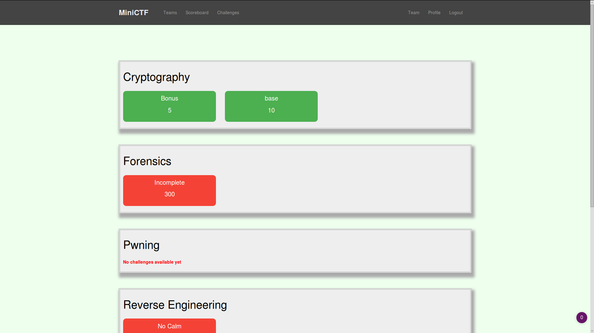
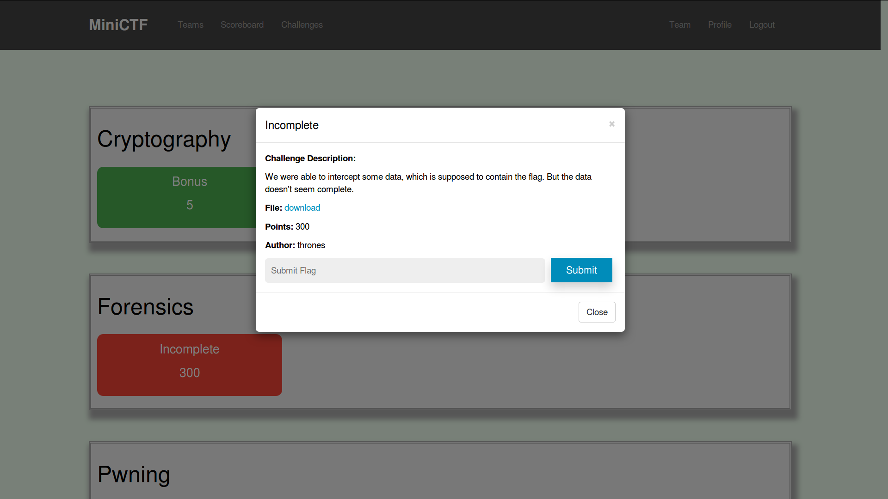
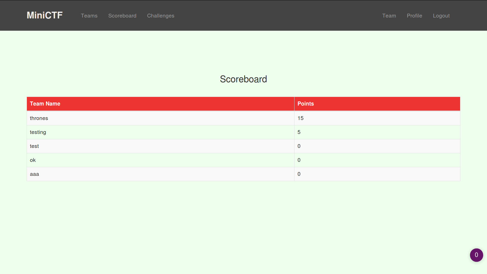
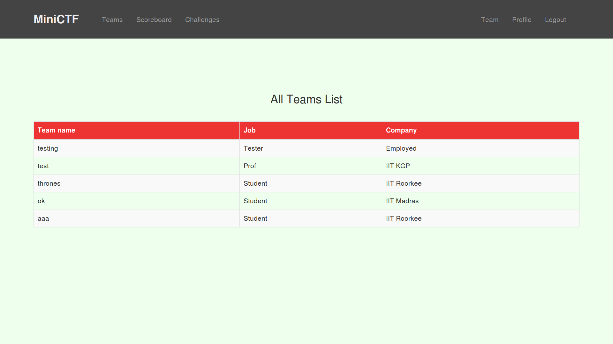
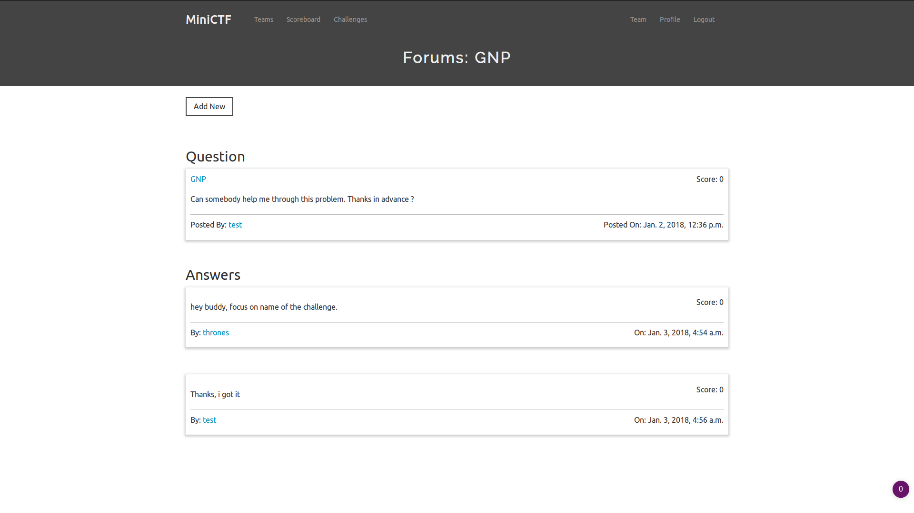

[](https://inventory.rawsec.ml/ctf_platforms.html#miniCTF)

# MINICTF

### A platform build in django for hosting CTF events. 

#### Live demo 

[https://xyz-minictf.herokuapp.com/](https://xyz-minictf.herokuapp.com/)

#### FEATURES :

* Cool Interface
* Score Board
* Responsive Design
* Password Change Support 
* Discussion Forums
* and a lot more.

#### SCREENSHOTS :

Challenge Page



Challenge View



Score Board



Team Details



Discussion Forums




#### Test it locally

###### Requirments

```
python 3.x
django 2.0
```

Install [Pipenv](https://pypi.org/project/pipenv/)

> Rename .env.example to .env and change the value of KEY. 
>
> **Note**: Keep this value a secret.

<b>Want to make this process fast. Switch to [local branch](https://github.com/DivyanshuSahu/miniCTF/tree/local)</b>

###### Install miniCTF

```bash
  git clone https://github.com/DivyanshuSahu/miniCTF.git
  pipenv shell
  pipenv install
  python manage.py makemigrations accounts challenges forums
  python manage.py migrate
  python manage.py runserver
```

Then register or create superuser and add challenges.
