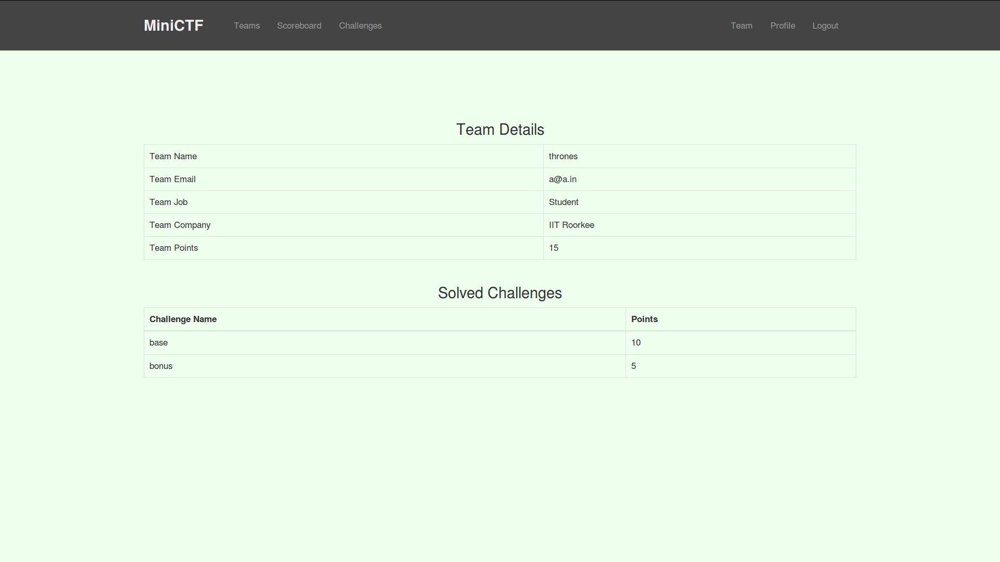

# MINICTF

### A platform build in django for hosting CTF events. 

#### Live demo 

###### Available Soon

#### FEATURES :

* Cool Interface
* Score Board
* Responsive Design
* Password Change Support 
* and a lot more.

#### SCREENSHOTS :

Challenge Page


Challenge View


Score Board


Team Details



All Teams list


#### Test it locally

###### Requirments

```
python 3.5.x
django 2.0
```

###### Install django

```sh
$ sudo pip3 install django
```

###### Install miniCTF

```sh
$ git clone https://github.com/DivyanshuSahu/miniCTF.git
$ django-admin startproject minictf
copy all files and folders from git clone folder(miniCTF) to django project folder(minictf), then
$ python manage.py makemigrations accounts challenges
$ python manage.py migrate
$ python manage.py runserver
```

Then register or create superuser and add challenges.